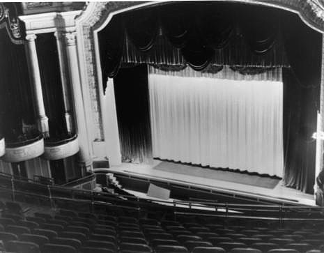

# The Digital Technology Crisis
## AI and Cinema Copyright Infringement

Digital technology has made film production faster and more flexible, but generative AI has also created a serious challenge for the cinema business. It threatens copyright protection, weakens control over film intellectual property, and creates new commercial risks for studios and performers.

## 1. Unauthorized Training Data

Generative AI models need huge amounts of visual data to learn. In many cases, movie frames, posters, concept art, and other copyrighted materials are collected without permission from the original creators or studios.

This creates a major problem for the cinema industry:

- copyrighted content may be reused without licensing
- film companies may receive no payment for the use of their assets
- exclusive intellectual property becomes easier to copy and exploit

In short, AI training can turn valuable film content into unlicensed data.

**News Example:** On June 11, 2025, AP reported that Disney and Universal sued Midjourney, arguing that the AI company generated unauthorized copies of famous film characters and relied on copyrighted studio material. This case shows how AI training and output can directly threaten film intellectual property.

## 2. AI-Generated Clones and Fake Content

AI can now imitate characters, actors' faces, voices, and even cinematic styles with impressive accuracy. This makes it possible to create fake trailers, fake sequels, deepfake performances, and unofficial derivative works.

These outputs can damage the cinema business by:

- confusing audiences about what is official and what is fake
- reducing the commercial value of original films
- harming the public image of actors and studios
- bypassing legal agreements about image rights and performance

As a result, AI does not only borrow from cinema. It can also compete with and undermine it.

**News Example:** On February 15, 2026, AP reported that Hollywood groups condemned ByteDance's Seedance 2.0 for allegedly using copyrighted works and performers' likenesses without permission. On February 20, 2026, Axios reported that the Motion Picture Association sent ByteDance a cease-and-desist letter, and several major studios also pushed back. This makes Seedance a strong example of how AI-generated video can create direct legal and ethical conflict for the film industry.

## 3. Why This Matters

Cinema depends on ownership, originality, and trust. Studios invest large amounts of money in stories, characters, and performers because these assets are legally protected and commercially controlled.

When AI can copy or imitate them at low cost, that foundation becomes weaker. The issue is not only technological. It is also legal, economic, and ethical.

**Policy Response:** On September 17, 2024, California Governor Gavin Newsom signed laws to strengthen protection for performers' digital likenesses, including consent requirements for AI-generated replicas and rules covering deceased performers. This shows that governments are beginning to treat AI replication as a serious entertainment industry issue.

## Key Message

Generative AI shows that digital technology is a double-edged sword for the cinema business. While it supports innovation, it also creates a copyright crisis. Without stronger regulation and clearer licensing rules, AI may continue to reduce the value and protection of film creativity.

## Image Credits

- Cinema auditorium image: [Wikimedia Commons - File:Capitol Auditorium.jpg](https://commons.wikimedia.org/wiki/File:Capitol_Auditorium.jpg)
- AI image: [Wikimedia Commons - File:AI-generated.svg](https://commons.wikimedia.org/wiki/File:AI-generated.svg)
- Copyright symbol: [Wikimedia Commons - File:Copyright.svg](https://commons.wikimedia.org/wiki/File:Copyright.svg)

## News References

- Associated Press, June 11, 2025: [Disney and Universal sue AI firm Midjourney for copyright infringement](https://apnews.com/article/disney-universal-midjourney-copyright-lawsuit-722b1b892192e7e1628f7ae5da8cc427)
- Associated Press, February 15, 2026: [Hollywood groups condemn ByteDance's AI video generator, claiming copyright infringement](https://apnews.com/article/ai-seedance-bytedance-hollywood-copyright-7e445388401d172c6bf51d0d42aa4f24)
- Axios, February 20, 2026: [Motion Picture Association sends cease-and-desist letter to ByteDance over Seedance 2.0](https://www.axios.com/2026/02/20/hollywood-seedance-intellectual-property)
- Governor of California, September 17, 2024: [Governor Newsom signs bills to protect digital likeness of performers](https://www.gov.ca.gov/2024/09/17/governor-newsom-signs-bills-to-protect-digital-likeness-of-performers/)
